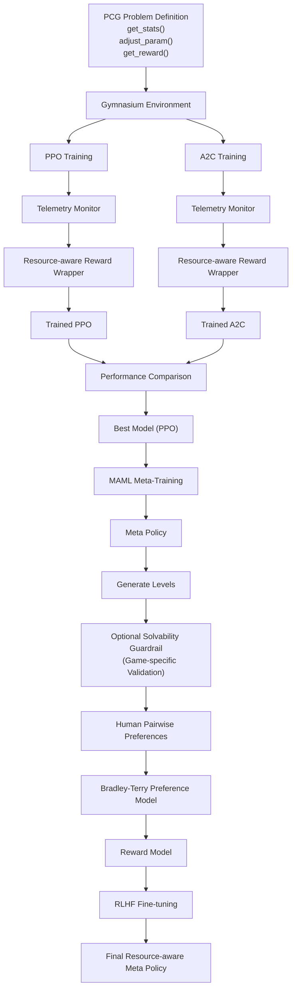

# Training Pipeline

## Overview

The RLPCG-MetaRL framework consists of four major stages:

1. Resource-aware Reinforcement Learning
2. Meta-Learning (MAML)
3. Reinforcement Learning from Human Feedback (RLHF)
4. Optional Solvability Validation

## Pipeline

## Stage Descriptions

### 1. PCG Problem Definition

Defines the procedural generation task through:

- `get_stats()`
- `adjust_param()`
- `get_reward()`

These form the Gymnasium environment used for RL training.

### 2. Resource-aware Reinforcement Learning

PPO and A2C are trained in parallel.

Telemetry is collected throughout training, and a resource-aware reward wrapper incorporates hardware utilization into the reward signal.

The best-performing policy is selected for meta-learning.

### 3. Meta-Learning (MAML)

The selected PPO model is meta-trained using MAML to enable rapid adaptation to unseen procedural content generation tasks.

### 4. Level Generation

The meta-policy generates candidate levels.

Optionally, generated levels pass through a game-specific solvability guardrail before human evaluation.

### 5. Reinforcement Learning from Human Feedback

Human evaluators perform pairwise comparisons between generated levels.

A Bradley-Terry Preference Model learns a reward model from these preferences.

The reward model is then used for RLHF fine-tuning, producing the final resource-aware meta policy.