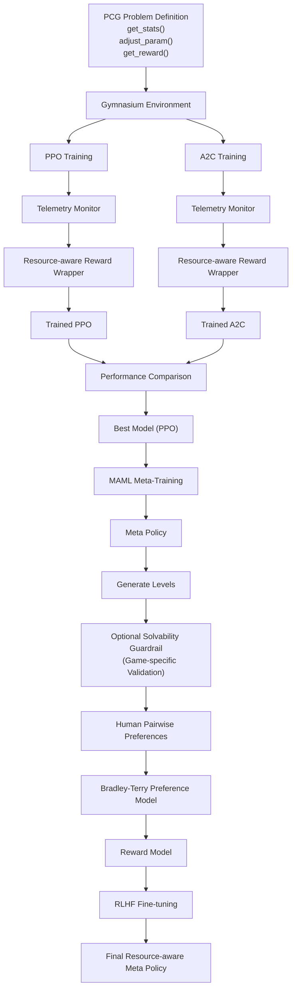

# Training Pipeline

## Overview

This document describes the complete training workflow of the RLPCG-MetaRL framework, from defining a procedural content generation (PCG) problem to obtaining the final resource-aware meta policy.

The framework consists of four major stages:

1. Resource-aware Reinforcement Learning
2. Meta-Learning (MAML)
3. Reinforcement Learning from Human Feedback (RLHF)
4. Optional Solvability Validation

---

## Training Pipeline

```text
            PCG Problem Definition
(Level Statistics: get_stats(),
 Constraints: adjust_param(),
 Rewards: get_reward())
                       │
                       ▼
              Gymnasium Environment
                       │
             ┌─────────┴──────────┐
             │                    │
             ▼                    ▼
      PPO Training          A2C Training
             │                    │
      Telemetry Monitor     Telemetry Monitor
             │                    │
             ▼                    ▼
  Resource-aware Reward    Resource-aware Reward
         Wrapper                  Wrapper
             │                    │
             ▼                    ▼
      Trained PPO         Trained A2C
             │                    │
             └────── Performance Comparison ──────┐
                                                  │
                                                  ▼
                                          Best Model (PPO)
                                                  │
                                                  ▼
                                        MAML Meta-Training
                                                  │
                                                  ▼
                                              Meta Policy
                                                  │
                                                  ▼
                                          Generate Levels
                                                  │
                                                  ▼
                          (Optional) Solvability Guardrail
                           (Game-specific Validation)
                                                  │
                                                  ▼
                                     Human Pairwise Preferences
                                                  │
                                                  ▼
                                   Bradley-Terry Preference Model
                                                  │
                                                  ▼
                                              Reward Model
                                                  │
                                                  ▼
                                         RLHF Fine-tuning
                                                  │
                                                  ▼
                                   Final Resource-aware Meta Policy
```


---

# Stage 1. PCG Problem Definition

Each procedural content generation task is implemented as a Problem class in `gym-pcgrl`.

The problem definition specifies:

- `get_stats()`
  - Computes level statistics such as connectivity, path length, tile counts, etc.

- `adjust_param()`
  - Defines controllable generation parameters and constraints.

- `get_reward()`
  - Defines the environment reward function used during reinforcement learning.

Together these define the Gymnasium environment used for agent training.

---

# Stage 2. Resource-aware Reinforcement Learning

The same environment is used to train multiple reinforcement learning algorithms.

Current implementations:

- PPO
- A2C

During training, a telemetry monitor continuously records system resource usage, including:

- CPU utilization
- RAM usage
- GPU utilization
- VRAM usage
- Other hardware metrics (optional)

A Resource-aware Reward Wrapper incorporates these measurements into the reward function, encouraging policies that maintain level quality while reducing computational cost.

After training, both algorithms are evaluated and compared.

The best-performing model becomes the base policy for meta-learning.

---

# Stage 3. Meta-Learning

The selected PPO policy is used as the initialization for Model-Agnostic Meta-Learning (MAML).

MAML trains a meta-policy capable of rapidly adapting to unseen procedural generation tasks using only a few gradient updates.

Output:

- Meta Policy

---

# Stage 4. Level Generation

The meta-policy generates candidate procedural levels.

Optionally, generated levels pass through a game-specific solvability guardrail.

Possible checks include:

- Connectivity validation
- Reachability
- Path existence
- Win condition verification
- Other game-specific constraints

This stage filters invalid content before human evaluation.

---

# Stage 5. RLHF

Valid generated levels are presented to human evaluators.

Human annotators perform pairwise comparisons:

Level A vs Level B

These comparisons are used to train a Bradley-Terry Preference Model.

The learned preference model produces a reward model representing human preferences.

The reward model is then used to fine-tune the meta policy using Reinforcement Learning from Human Feedback (RLHF).

---

# Final Output

The final output of the framework is a Resource-aware Meta Policy that:

- Generates high-quality procedural content
- Adapts rapidly to new PCG tasks
- Optimizes computational resource usage
- Aligns generated content with human preferences
- Optionally guarantees solvability through game-specific validation